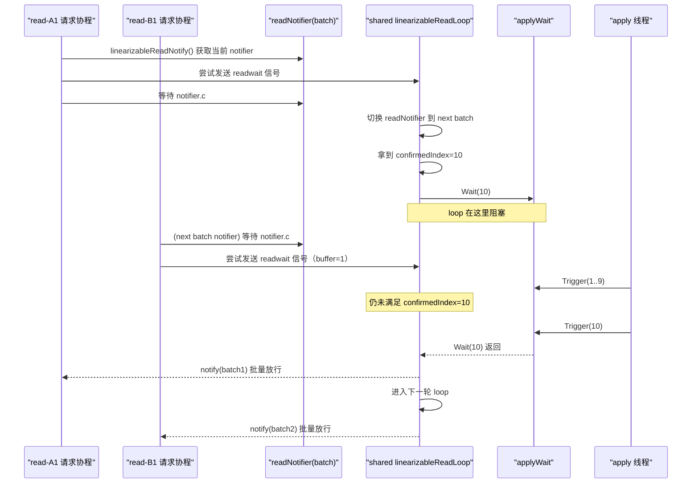

# linearizable-read-demo

这个 demo 用最小代码模拟 etcd 里 linearizable read 的核心结构，帮助理解下面这句话：

- 每个读请求都有自己的 `linearizableReadNotify`
- 但它们共享一个 `linearizableReadLoop`

## 对应关系（和 etcd 概念）

- `Server.linearizableReadNotify(...)`
  - 模拟每个读请求在入口处等待线性一致性确认
- `Server.linearizableReadLoop()`
  - 模拟 etcd 的单个后台 loop（共享）
- `readNotifier`
  - 模拟“按批次唤醒”机制
- `readwaitc`（buffer=1）
  - 模拟通知 loop 有读请求到来
- `applyWait.Wait/Trigger`
  - 模拟 `appliedIndex` 追上 `confirmedIndex` 前，loop 阻塞等待

## 运行

```bash
go run main.go
```

如果你本机 Go cache 权限有限，也可以这样：

```bash
GOCACHE=/tmp/go-build-cache go run main.go
```

## 你会看到什么

运行日志里通常会出现这几类信息：

1. `read-A*` 先到达，进入 `waiting on its own notify handle`
2. `loop #1` 拿到 `confirmedIndex=10`，然后 `blocked at applyWait.Wait(10)`
3. 阻塞期间 `read-B*` 还能继续到达，也会进入 waiting（说明后续请求会阻塞等待）
4. `apply: Trigger(10)` 后，`loop #1` 被释放并 notify 一批请求
5. 紧接着 `loop #2` 处理下一批

## 关键结论

- 是的，后续 linearizable 读请求也会被阻塞（等待）。
- 但不是每个请求都直接卡在 `applyWait.Wait(...)`。
- 真正卡在 `applyWait.Wait(...)` 的是共享的 `linearizableReadLoop`。
- 每个请求通常是卡在自己的 notify 等待点，等 loop 批量放行。

## 时序图



## 建议你试着改的参数

为了加深理解，你可以改这几处：

1. 把 `confirmedIndex := uint64(10)` 改大/改小，观察等待时长变化
2. 调整 `apply` goroutine 的 `Sleep`，模拟快/慢 apply
3. 增加 A/B 请求数量，观察批量放行现象
4. 把 B 批请求的发送时间提前或延后，观察它落在哪个 batch
